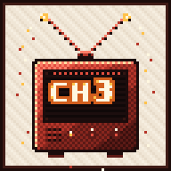
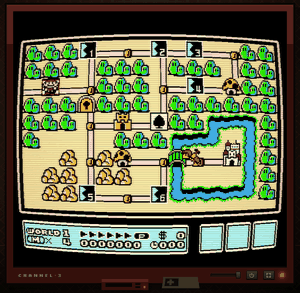
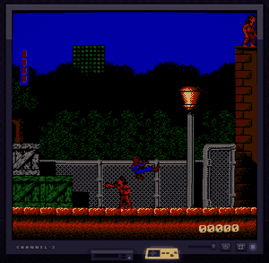
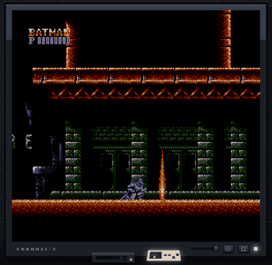
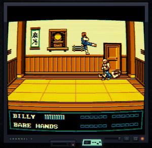
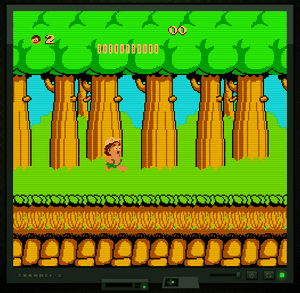
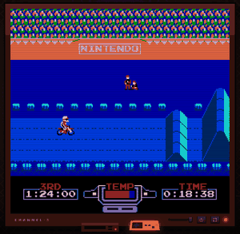

<div align="center">



# Channel 3

**A Nintendo Entertainment System that lives in a browser tab — and behaves like a television.**

Boot it and you get static. Tune past it and there's a shelf of cartridges,
a CRT that warms up when you switch it on and collapses to a line when you
switch it off, and a friend one room code away.

</div>

---

## The set

|  |  |  |
| :-: | :-: | :-: |
|  |  |  |
| **Famicom** · curved tube | **Twilight Purple** · RGB monitor | **Ghost Slate** · scanlines |
|  |  |  |
| **Ice & Neon** · worn VHS | **Phosphor Green** · raw pixels | **Famicom** · scanlines |

Five themes, six CRT presets, and none of it is a filter over a screenshot —
the shader runs on the live framebuffer at 60 fps.

---

## What's in it

**A headless core.** [jsnes](https://github.com/bfirsh/jsnes) runs detached
from any UI. Video goes from the framebuffer straight into a WebGL texture;
audio goes to an AudioWorklet. Nothing about the emulator knows a DOM exists.

**A real CRT pipeline.** Barrel curvature, scanlines, an aperture-grille mask,
phosphor glow, chromatic aberration and vignette — every parameter live from
the CONFIG panel, with five presets and a custom mode. Overscan is cropped 8px
top and bottom, the way a television did it.

**Netplay that only sends a byte.** WebRTC through peerjs, in deterministic
frame lockstep. Each peer sends one controller byte per frame and nothing else;
a three-frame input delay (~50 ms) hides the round trip. The host ships the ROM
to the guest over the data channel, so both sides start from identical memory.
Room codes are six letters, shown like a NES password screen.

**Rewind.** Hold <kbd>Backspace</kbd> and travel back about sixty seconds,
over a ring of 120 state snapshots taken twice a second. The picture wobbles
like a VHS while you do it.

**Twelve games, no ROM hunting.** All freely distributable, all credited in-app
under CONFIG → GAME CREDITS with their license and source. Drag in your own and
they persist to IndexedDB, keyed by SHA-256 so a rename doesn't orphan the save.

**It works with the lights off.** The service worker precaches everything the
emulator needs, ROMs included, so offline it behaves like a console. Only
netplay needs the network.

**Cartridge art nobody drew.** Each cart's label is a screenshot of that game
actually being played: the ROM runs headless in a Web Worker until it finds a
lively frame, then that frame becomes the label. The capture point is
randomised, so no two installs have the same shelf.

**A whole television, not a canvas.** Boot static, a power ramp that opens the
picture from a bright line, a 3D cartridge carousel, ambient room light sampled
from the framebuffer, square-wave UI blips synthesised in the APU's idiom, and
a power button that genuinely switches the set off.

**Touch, keyboard, gamepad.** An on-screen NES pad appears when you're playing
on a touch device with no controller attached. Every action is rebindable, for
both players, keys and pad buttons alike.

---

## Run it

```sh
npm install
npm run dev
```

Then drop any `.nes` file onto the screen, or pick one off the shelf.

```sh
npm run build      # tsc --noEmit && vite build
npm run preview    # serve the production build
```

### Netplay

1. Player 1 starts a game and hits **LINK UP → HOST GAME**. A six-letter room
   code appears.
2. Player 2 opens the app anywhere, types the code, hits **JOIN**.
3. The ROM transfers and both sides restart in lockstep. Host is P1.

---

## Controls

| Key | | Key | |
| --- | --- | --- | --- |
| Arrows | D-pad | <kbd>K</kbd> / <kbd>L</kbd> | Save / load state |
| <kbd>X</kbd> / <kbd>Z</kbd> | A / B | <kbd>Backspace</kbd> (hold) | Rewind |
| <kbd>Enter</kbd> / <kbd>Shift</kbd> | Start / Select | <kbd>P</kbd> | Pause |
| <kbd>V</kbd> | Link up | <kbd>F</kbd> | Fullscreen |

Player 2 shares the keyboard on WASD + Q/E. Standard-mapping gamepads work for
both players, and everything above is rebindable in CONFIG → CONTROLS.

---

## Architecture

```
src/
  main.ts          view state machine, main loop, carousel, wiring
  emulator.ts      jsnes wrapper: ROM loading, pad bitmasks, snapshots
  video.ts         WebGL renderer + CRT shader (power ramp, VHS, static)
  audio.ts         AudioWorklet ring buffer, ScriptProcessor fallback
  input.ts         keyboard + gamepad + touch → 1-byte pad bitmask
  netplay.ts       peerjs lockstep (input delay, ROM transfer, room codes)
  rewind.ts        snapshot ring buffer
  library.ts       IndexedDB store for added ROMs, saves backup/restore
  roms.ts          bundled-library manifest + fetching
  nesdb.ts         CRC32 → real title/author/year for dropped ROMs
  labels.ts        cart label cache + Worker orchestration
  labelScan.ts     the headless run that finds a label frame (pure)
  labelWorker.ts   runs labelScan off the main thread
  sfx.ts           square-wave UI sounds, no assets
```

### Things worth knowing

**The pad is one byte.** Bit *i* is jsnes button *i*. That single byte is the
entire netplay payload per frame — everything else follows from the core being
deterministic.

**Audio sets the pace, not video.** The loop runs a frame when the AudioWorklet's
queue is draining, not when rAF says so. Underruns degrade to silence rather
than to clicks, and the emulator quietly catches up instead of drifting.

**The power ramp is not a CRT effect.** It's a geometric transform of the tube
itself, so it applies whether or not the shader is on — otherwise switching the
set off would do nothing in the default preset.

**Label generation is off-thread.** It emulates roughly three thousand frames
per game, which on the main thread dropped the gallery to 20 fps on a first
visit. In a Worker it costs the UI nothing and the shelf holds 60.

**Every theme owns its whole palette.** Nothing borrows a colour from another
theme — including what NES.css hardcodes, which is overridden so the library's
white borders and blue button edges don't leak through.

---

## Credits

- **Emulation core** — [jsnes](https://github.com/bfirsh/jsnes), by Ben Firshman
  and contributors.
- **P2P transport** — [peerjs](https://peerjs.com).
- **UI components** — [NES.css](https://nostalgic-css.github.io/NES.css/).
  **Font** — Silkscreen, by Jason Kottke.
- **Title database** — CRC32 lookup built from
  [libretro-database](https://github.com/libretro/libretro-database) No-Intro
  and metadat sets.
- **The bundled games remain their authors'.** Every entry in
  [`public/roms/manifest.json`](public/roms/manifest.json) records its license
  and where it came from, and the same list is in the app under CONFIG → GAME
  CREDITS.

Built from scratch here: the CRT pipeline, the lockstep netplay protocol, the
rewind system over jsnes serialisation, the label generator, and the whole
diegetic interface.

---

## Known limitations

**Mappers.** jsnes implements 0, 1, 2, 3, 4, 5, 7, 11, 34, 38, 66, 94, 140 and
180. Modern homebrew often ships as mapper 30 (UNROM 512) for its flash saving,
and those render black. *Alter Ego* and *Zooming Secretary* (Shiru) are two
that don't run and were left out of the shelf for that reason.

**Netplay needs the public peerjs broker** to introduce the two peers. The game
traffic is direct once they're connected, but the handshake depends on a
third-party service being up.

**Save states live in `localStorage`**, which is a few megabytes per origin.
Large states can fail to write; the app says so rather than failing quietly.
