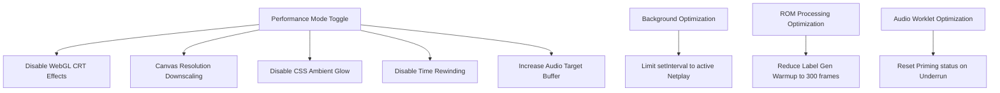

# Performance Analysis & Optimization Proposals

This document analyzes the current performance profile of the Channel 3 (NetNes) emulator on less powerful devices (mobile phones, tablets, integrated GPUs, and low-end laptops) and outlines concrete proposals for improvement.

---

## 1. Identified Performance Bottlenecks

### 1.1 Heavy Fragment Shader Workload (WebGL CRT Shader)
* **Problem:** The WebGL CRT filter (`src/video.ts`) is highly complex. For every single pixel, it calculates barrel curvature distortion, aperture-grille masks, vignette falloff, VHS jitter, chromatic aberration, and phosphor glow. 
* **Details:**
  - Chromatic aberration (`sampleCRT`) performs **3 texture lookups** per pixel.
  - Phosphor glow adds a cheap 4-tap blur which performs **4 additional texture lookups** per pixel.
  - Scale2x/EPX upscaling (`sampleEPX`) does **5 texture lookups**.
  - Total lookup count reaches **7 to 9 texture lookups per fragment** when glow/CRT/EPX are combined.
  - **Resolution Scaling:** The canvas backing store size is scaled using `window.devicePixelRatio`, capped at a height of 960px. On high-DPI (e.g. Retina) mobile displays, this resolves to nearly 1 million pixels. Performing up to 9 texture lookups and heavy coordinate math per fragment at 60 FPS is extremely taxing for integrated or mobile GPUs, leading to thermal throttling and frame drops.

### 1.2 Layout Thrashing from CSS Ambient Glow Transitions
* **Problem:** Every 15 frames, `updateAmbient()` samples the framebuffer and updates the CSS custom property `--ambient` on `#stage`. 
* **Details:**
  - In CSS (`src/style.css`), `#tv-zone::before` transitions the ambient background color using `transition: background 0.4s;`.
  - Dynamically updating a CSS variable that drives a transitioned gradient backdrop forces the browser to recalculate styles, repaint, and trigger expensive layout passes on every update. On mobile browsers, this causes noticeable stuttering and CPU spikes.

### 1.3 Unnecessary Background Emulation (Hidden Tabs)
* **Problem:** To keep Netplay synchronized when a user tab is hidden (since `requestAnimationFrame` pauses), the application utilizes a `setInterval` running every 16ms:
  ```typescript
  setInterval(() => {
    if (document.hidden) tick(performance.now());
  }, 16);
  ```
* **Details:**
  - This interval calls `tick()` unconditionally when the page is hidden, even if Netplay is **not** active.
  - As a result, when the user is in single-player mode, or simply idling on the gallery screen, backgrounding the tab continues to run the attract mode NES emulator (`demoEmu.frame()`) or static generator (`genStatic()`) at 60 Hz in the background. This drains battery, causes heating, and risks browser-enforced tab suspension.

### 1.4 Background ROM Label Generation Overhead
* **Problem:** When new ROMs are imported, the app lazily runs them headless in the background to photograph a title screen for the cartridge label (`src/labels.ts`).
* **Details:**
  - The emulator runs headless for **1,020 frames (~17 seconds of gameplay)** per ROM to find the frame with the highest color variety and brightness.
  - Although it yields every 30 frames using `setTimeout(r, 0)`, running 17 seconds of emulation per ROM still generates substantial CPU load and garbage collection pressure, especially if a user imports multiple ROMs at once.

### 1.5 Snapshot Cloning CPU & GC Pressure (Time Rewind)
* **Problem:** Every 15 frames, the game state is snapshotted for the rewind system.
* **Details:**
  - A snapshot deep-clones the entire JSNES core state:
    ```typescript
    return { core: structuredClone(this.nes.toJSON()), apu: this.apuState() };
    ```
  - `structuredClone` is a synchronous, CPU-intensive operation. Doing this 4 times per second creates significant garbage collection (GC) overhead as older snapshots are dropped from the 240-limit ring buffer.

### 1.6 Audio Latency & JSNES Emulation Speed Link
* **Problem:** The audio system experiences crackling, "lag," or synchronization issues.
* **Details:**
  - **Single-Threaded Constraint:** JSNES is a purely JavaScript-based interpreter (not compiled to WebAssembly/WASM) and runs entirely on the browser's main UI thread. Any layout engine activity, garbage collection, or slow GPU frames block the JS thread, slowing emulation below the ~16.6ms threshold required for real-time 60 FPS.
  - **Dynamic Audio Pacing Loop:** The game loop in `src/main.ts` attempts to dynamically adjust emulation speed by ±1.5% (`effFrameMs`) based on the reported queue depth of the `AudioWorklet` (`audio.bufferedSamples`). If emulation speed drops below real-time, the audio worklet's queue drains to `0`, resulting in an **underrun**.
  - **Priming State Lock:** In `src/audio.ts`, the audio worklet processor uses a priming cushion (`primeTarget = 2048` samples, ~43ms) before it starts playing. However, once the worklet is primed (`this.primed = true`), it **never resets** to false when an underrun occurs. If the buffer drains completely, incoming audio slices are played immediately as they arrive without any jitter buffer protection, perpetuating a clicky, crackly, and out-of-sync audio output even if the emulator performance recovers.

---

## 2. Proposals for Improvement

To address these bottlenecks, we propose introducing a **"Performance Mode" (or "Low-Power Mode")** toggle in the configuration menu, along with target optimizations.



### Proposal A: Implement "Performance Mode" Settings Toggle
Adding a "Performance Mode" option to the settings menu enables the following optimizations:

1. **Disable CRT Shader:** Set `u_enabled` to `0.0`. This causes the fragment shader to immediately return raw pixels with a single texture lookup, bypassing all curvature, vignette, aberration, scanline, and glow math.
2. **Canvas Resolution Downscaling:** If Performance Mode is active, bypass Device Pixel Ratio (DPR) scaling and set the canvas size to the native NES viewport (`256` × `224` or `240` px). Let the browser's compositor scale the canvas using CSS `image-rendering: pixelated;`, which is executed in hardware with practically zero overhead. This reduces the WebGL rasterizer workload by over **90%** on high-DPI screens.
3. **Disable CSS Ambient Updates:** Bypass `updateAmbient()` calls completely to prevent CSS style recalculations and layout passes.
4. **Disable Rewind Snapshotting:** Stop taking snapshots and clear the rewind buffer to eliminate `structuredClone` overhead and related GC garbage.

### Proposal B: Limit Hidden Tab Emulation to Active Netplay
Modify the background keep-alive interval so that it only runs when Netplay is actually active:
```typescript
// Keep netplay alive when the tab is hidden (rAF stops firing).
setInterval(() => {
  if (document.hidden && netplay.active) {
    tick(performance.now());
  }
}, 16);
```
* **Impact:** Eliminates 100% of CPU usage for backgrounded single-player tabs and idle gallery screens.

### Proposal C: Optimize and Throttle Ambient Room Glow
If the user wants ambient room glow active, we can optimize it by:
1. Removing `transition: background 0.4s;` from `#tv-zone::before` in CSS (or replacing it with a simple GPU-accelerated opacity transition).
2. Updating `--ambient` less frequently (e.g., every 30 or 60 frames) since ambient lighting doesn't need high-frequency updates.
3. Completely skipping the sampling loop and DOM update if the screen is dark/blank (average color remains black).

### Proposal D: Streamline Game Label Generation
Optimize `src/labels.ts` to reduce initial generation lag:
1. **Reduce Frame Depth:** Cap the generation search at 300 frames (~5 seconds of gameplay) instead of 1,020 frames. Most NES games show their title or menu screens within the first 5 seconds.
2. **Disable in Performance Mode:** If Performance Mode is enabled, skip auto-generation of label art and display a generic cartridge label instead.

### Proposal E: Audio Worklet Priming & Buffer Tuning
Improve audio resiliency under transient frame stutters:
1. **Reset Priming on Underrun:** Update the `process` function in the Web Audio Worklet (`src/audio.ts`) to set `this.primed = false` when `this.available === 0`. This ensures that if the buffer runs dry, it correctly pauses and rebuilds the ~43ms `primeTarget` cushion before resuming playback, preventing continuous crackling.
2. **Increase Target Latency Option:** In Performance Mode, increase the target buffer depth slightly (e.g. from 50ms to 80ms or 100ms). This gives a larger safety buffer for JSNES to finish emulation cycles without causing audio underruns on slow CPU threads.
3. **Future Architecture - Web Workers:** Offload JSNES emulation entirely to a Web Worker thread, passing the WebGL framebuffer and audio chunks via transferable buffers to fully protect emulation and audio performance from main-thread rendering/layout lag.

